## Part 1. Инструмент ipcalc

- **1.1. Сети и маски**
  - **Адрес сети 192.167.38.54/13:**
    - Network: 192.160.0.0/13
  - **Перевод масок:**
    - 255.255.255.0 -> /24, 11111111.11111111.11111111.00000000
    - /15 -> 255.254.0.0, 11111111.11111110.00000000.00000000
    - 11111111.11111111.11111111.11110000 -> 255.255.255.240, /28
  - **Минимальный и максимальный хост в сети 12.167.38.4:**
    - /8 -> HostMin 12.0.0.1, HostMax 12.255.255.254
    - 11111111.11111111.00000000.00000000 -> HostMin 12.167.0.1, HostMax 12.167.255.254
    - 255.255.254.0 -> HostMin 12.167.38.1, HostMax 12.167.39.254
    - /4 -> HostMin 0.0.0.1, HostMax 15.255.255.254

- **1.2. localhost**
  - 194.34.23.100 — нет (не входит в 127.0.0.0/8)
  - 127.0.0.2 — да (входит в 127.0.0.0/8)
  - 127.1.0.1 — да (входит в 127.0.0.0/8)
  - 128.0.0.1 — нет (не входит в 127.0.0.0/8)

- **1.3. Диапазоны и сегменты сетей**
  - **Публичные/частные IP:**
    - 10.0.0.45 — частный
    - 134.43.0.2 — публичный
    - 192.168.4.2 — частный
    - 172.20.250.4 — частный
    - 172.0.2.1 — публичный
    - 192.172.0.1 — публичный
    - 172.68.0.2 — публичный
    - 172.16.255.255 — частный
    - 10.10.10.10 — частный
    - 192.169.168.1 — публичный
  - **Возможные IP-шлюзы в сети 10.10.0.0/18:**
    - 10.0.0.1 — нет
    - 10.10.0.2 — да
    - 10.10.10.10 — да
    - 10.10.100.1 — нет
    - 10.10.1.255 — да

## Part 2. Статическая маршрутизация между двумя машинами

- **Вывод существующих интерфейсов ws1 и ws2:**
  - Скрин: вывод `ip a` на ws1
    - 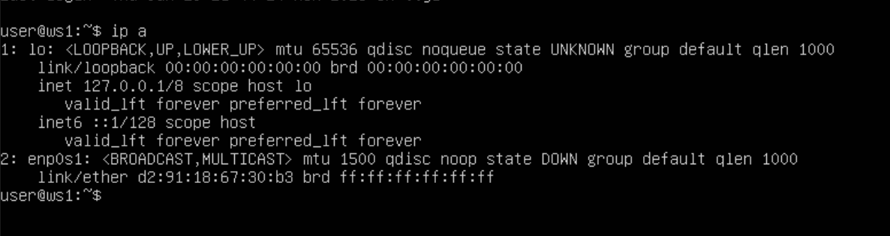
  - Скрин: вывод `ip a` на ws2
    - 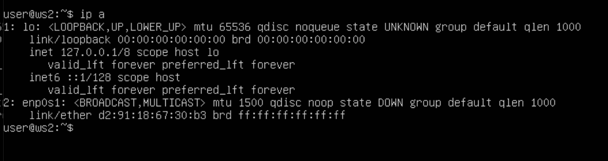

- **Описание сетевого интерфейса и настройка адресов:**
  - Скрин: `etc/netplan/00-installer-config.yaml` на ws1
    - 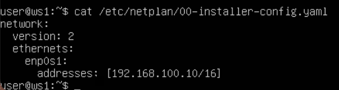
  - Скрин: `etc/netplan/00-installer-config.yaml` на ws2
    - 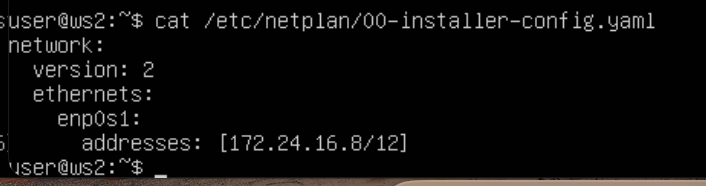

- **Применение настроек:**
  - Команда: `sudo netplan apply`
  - Скрин: вывод `netplan apply` на ws1
    - 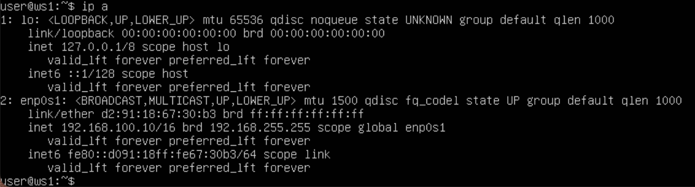
  - Скрин: вывод `netplan apply` на ws2
    - 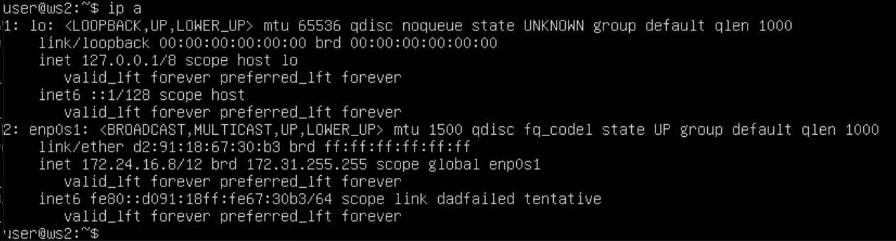

- **2.1. Добавление статического маршрута вручную**
  - Скрин: `sudo ip route add` на ws1
    - 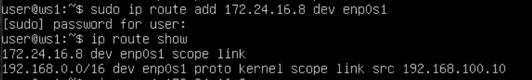
  - Скрин: `sudo ip route add` на ws2
    - 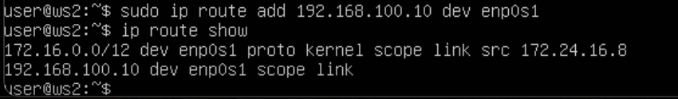
  - Скрин: ping ws1 -> ws2
    - 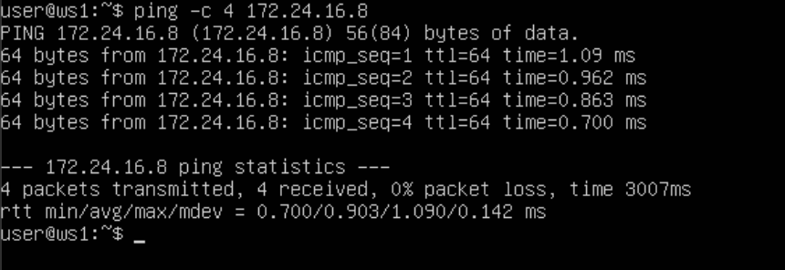
  - Скрин: ping ws2 -> ws1
    - 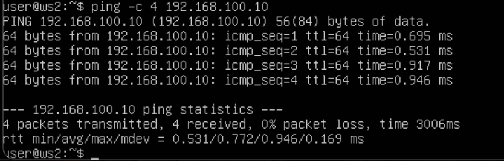

- **2.2. Добавление статического маршрута с сохранением**
  - Скрин: `etc/netplan/00-installer-config.yaml` на ws1
    - 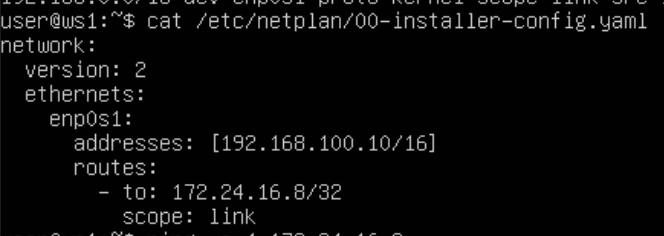
  - Скрин: `etc/netplan/00-installer-config.yaml` на ws2
    - 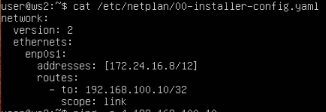
  - Скрин: ping ws1 -> ws2
    - 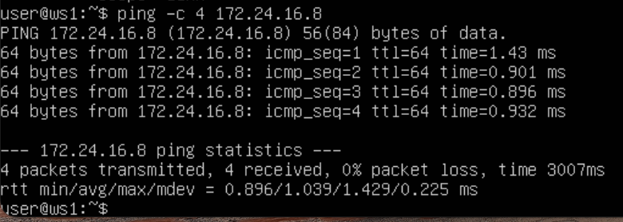
  - Скрин: ping ws2 -> ws1
    - 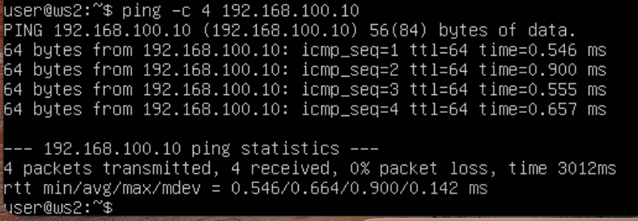

## Part 3. Утилита iperf3

- **3.1. Скорость соединения (перевод единиц):**
  - 8 Mbps -> 1 MB/s (делим на 8)
  - 100 MB/s -> 800 000 Kbps (100 MB/s * 8 = 800 Mbps; 800 Mbps * 1000 = 800 000 Kbps)
  - 1 Gbps -> 1000 Mbps

- **3.2. Утилита iperf3:**
  - Установка: `sudo apt install iperf3 -y`
  - Скрин: ws1 (server)
    - 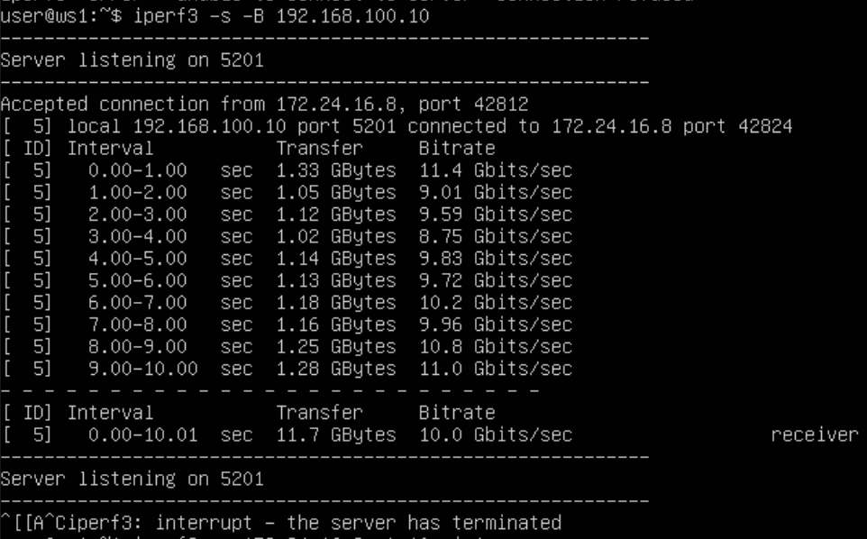
  - Скрин: ws2 (client)
    - 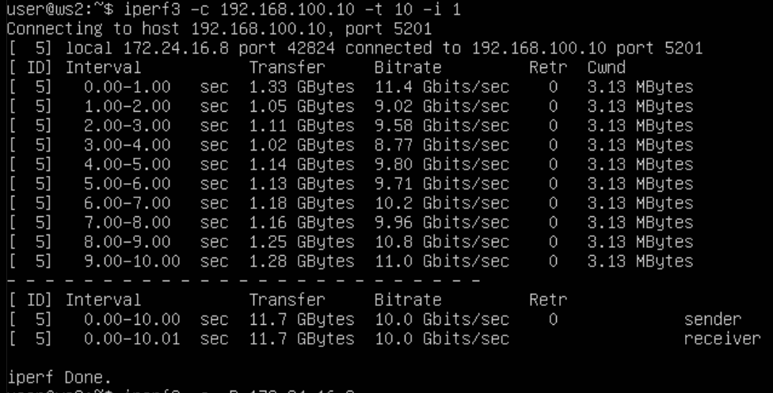
  - Результат скорости: 10.0 Gbits/sec
  - Скрин: ws1 (client)
    - 
  - Скрин: ws2 (server)
    - 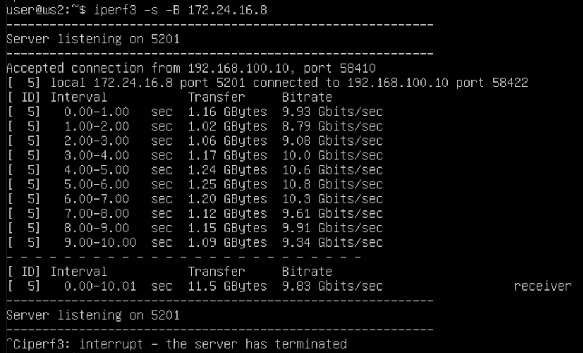
  - Результат скорости: 9.83 Gbits/sec

## Part 4. Сетевой экран

- **4.1. Утилита iptables**
  - Создан файл `/etc/firewall.sh` на ws1 и ws2
  - Правила:
    - Очистка таблицы `filter`
    - Разрешение портов 22 (SSH) и 80 (HTTP)
    - На ws1: сначала DROP для echo-reply, затем ACCEPT
    - На ws2: сначала ACCEPT для echo-reply, затем DROP
  - Скрин: содержимое правил на ws1
    - 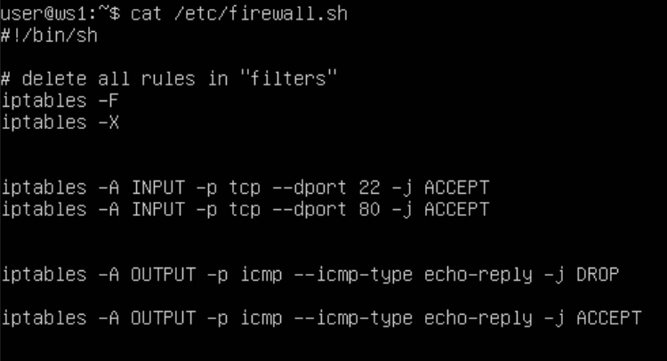
  - Скрин: содержимое правил на ws2
    - 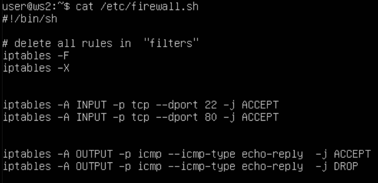
  - Выполнены команды:
    - `sudo chmod +x /etc/firewall.sh`
    - `sudo /etc/firewall.sh`
    - `sudo iptables -L -n -v`
  - Скрин: вывод iptables на ws1
    - 
  - Скрин: вывод iptables на ws2
    - 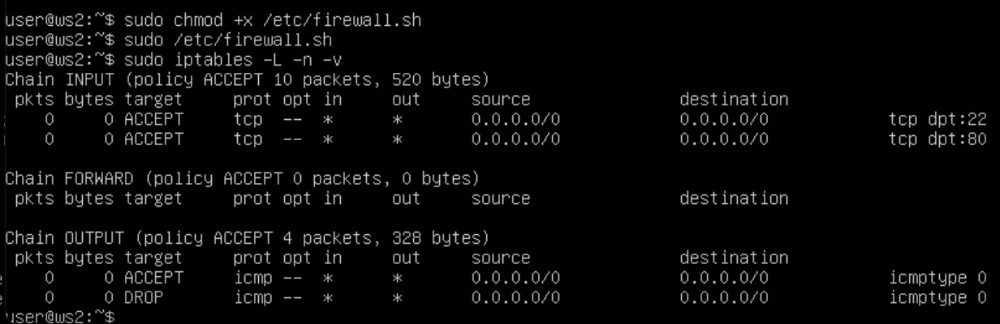
  - Разница стратегий:
    - ws1 (DROP -> ACCEPT): echo-reply блокируется, последующее ACCEPT не срабатывает
    - ws2 (ACCEPT -> DROP): echo-reply разрешается первым правилом, последующее DROP не влияет

- **4.2. Утилита nmap**
  - Скрин: ping ws1 -> ws2
    - 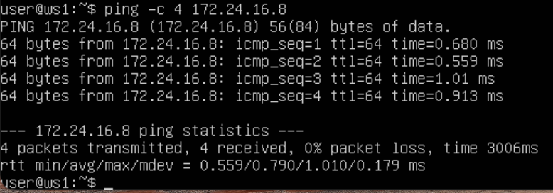
  - Скрин: ping ws2 -> ws1
    - 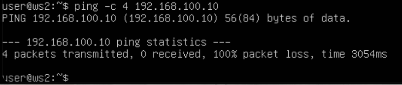
  - Результат: ws1 не пингуется с ws2
  - Скрин: `nmap` ws2 -> ws1
    - 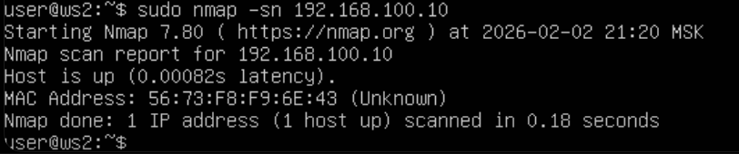
  - Результат: Host is up

## Part 5. Статическая маршрутизация сети

- **5.1. Настройка адресов машин**
  - Поднято 5 ВМ: ws11, ws21, ws22, r1, r2
  - Настроены статические IP в `/etc/netplan/01-static.yaml`
  - Скрин: ws11 netplan
    - 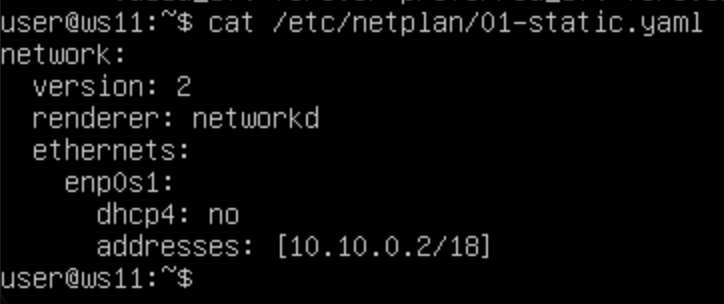
  - Скрин: ws21 netplan
    - 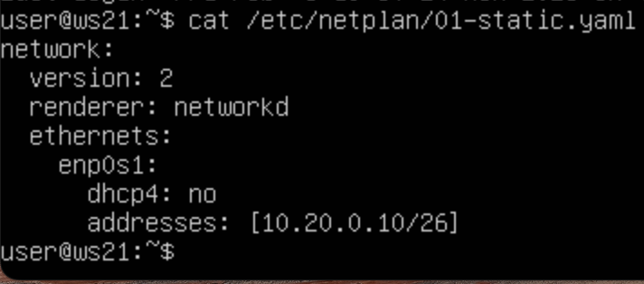
  - Скрин: ws22 netplan
    - 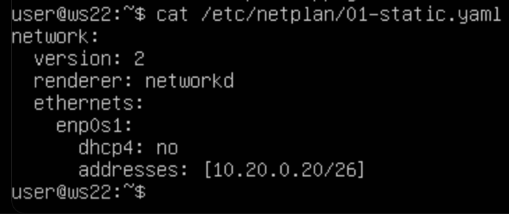
  - Скрин: r1 netplan
    - 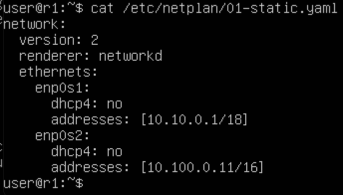
  - Скрин: r2 netplan
    - 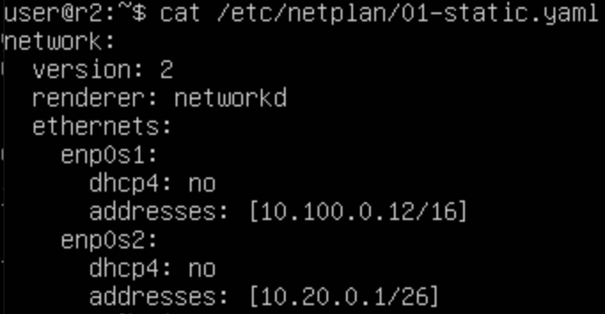
  - Применение: `sudo netplan apply`
  - Проверка IP: `ip -4 a`
  - Скрин: ip a ws11
    - 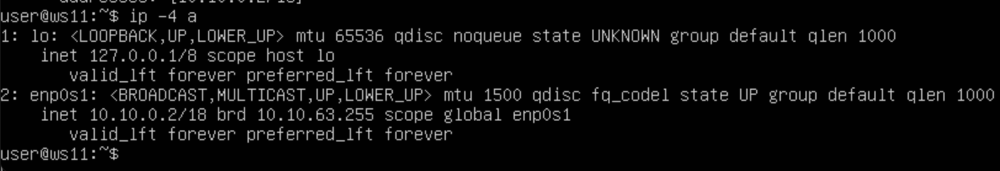
  - Скрин: ip a ws21
    - 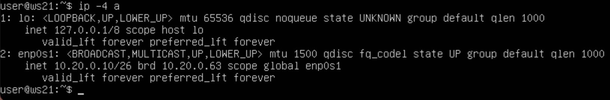
  - Скрин: ip a ws22
    - 
  - Скрин: ip a r1
    - 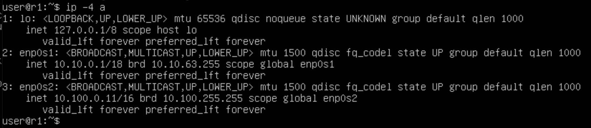
  - Скрин: ip a r2
    - 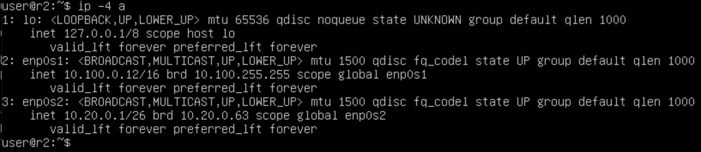
  - Проверка связности:
    - ping ws22 с ws21
    - ping r1 с ws11
  - Скрин: ping ws21 -> ws22
    - 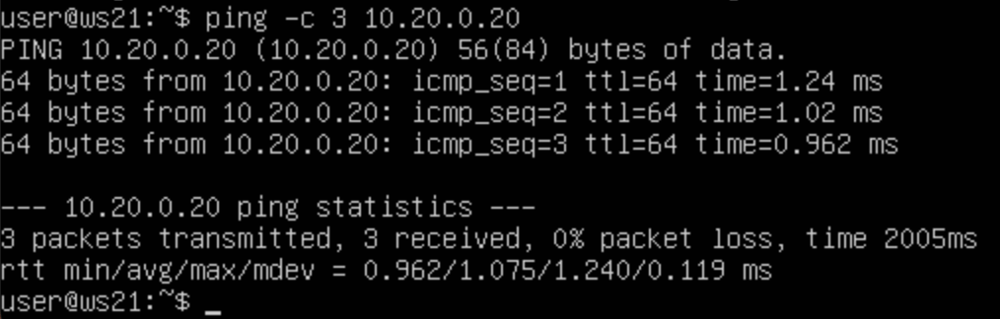
  - Скрин: ping ws11 -> r1
    - 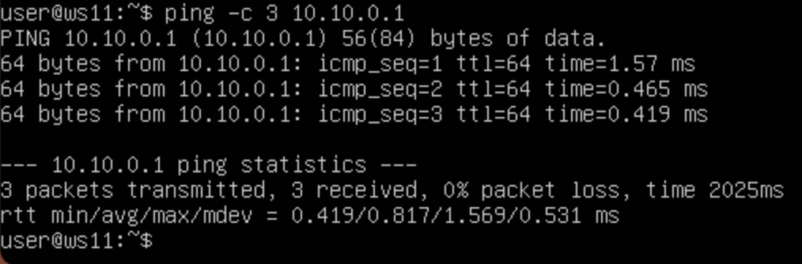

- **5.2. Включение переадресации IP**
  - Временно: `sysctl -w net.ipv4.ip_forward=1`
  - Скрин: r1
    - 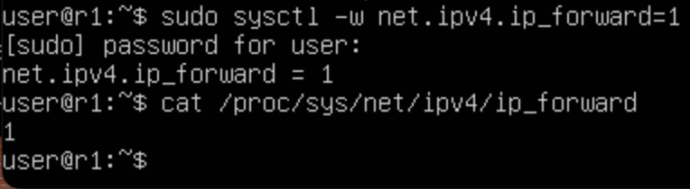
  - Скрин: r2
    - 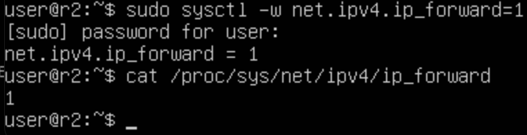
  - Постоянно: добавлена строка `net.ipv4.ip_forward = 1` в `/etc/sysctl.conf`
  - Скрин: sysctl.conf на r1
    - 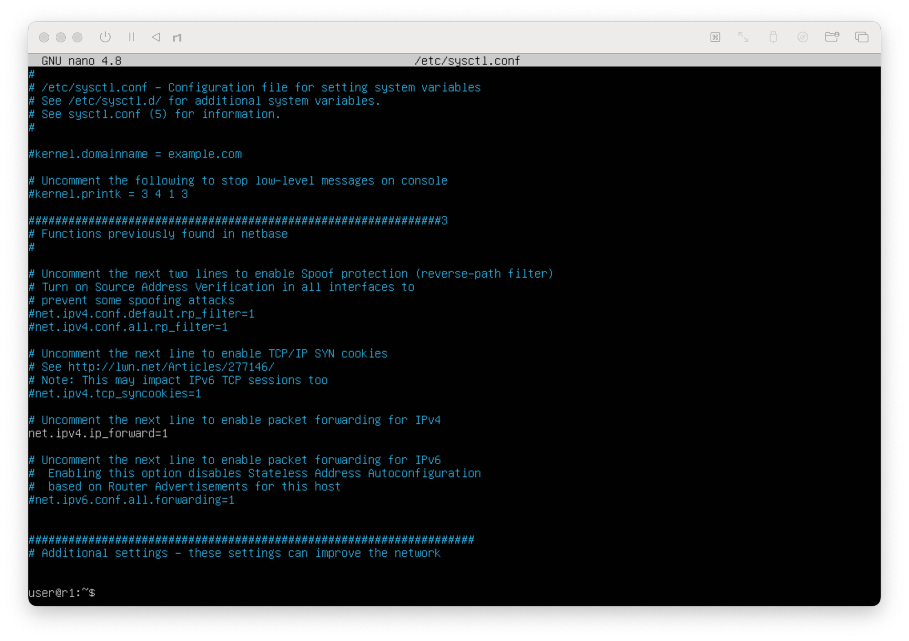
  - Скрин: применение sysctl на r1
    - 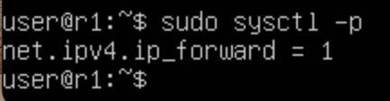
  - Скрин: sysctl.conf на r2
    - 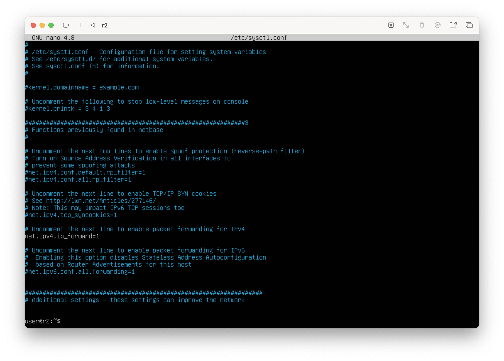
  - Скрин: применение sysctl на r2
    - 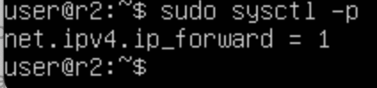

- **5.3. Маршрут по умолчанию**
  - Добавлен default route в `/etc/netplan/01-static.yaml`
  - Скрин: ws11 netplan
    - 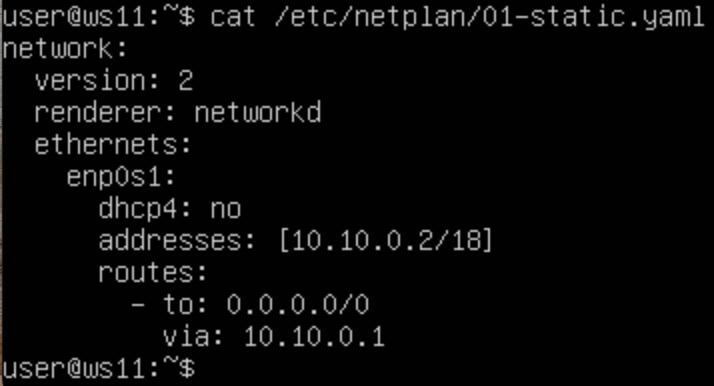
  - Скрин: ws21 netplan
    - 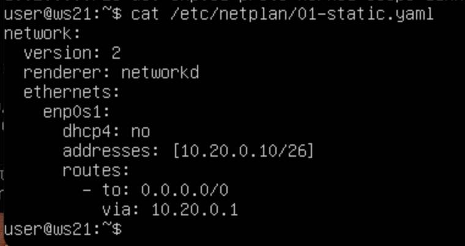
  - Скрин: ws22 netplan
    - 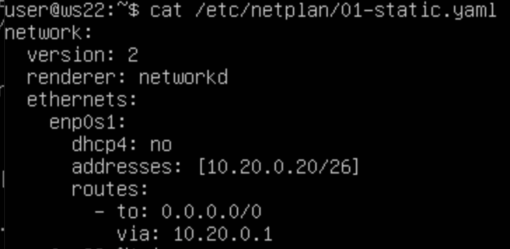
  - Применение: `sudo netplan apply`
  - Проверка маршрутов: `ip r`
  - Скрин: ip r ws11
    - 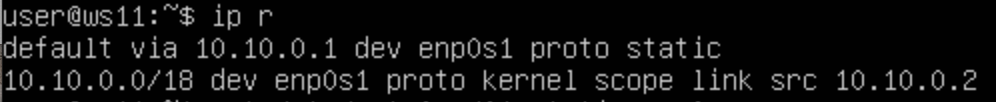
  - Скрин: ip r ws21
    - 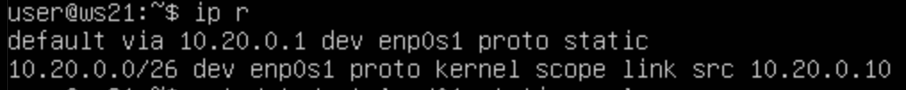
  - Скрин: ip r ws22
    - 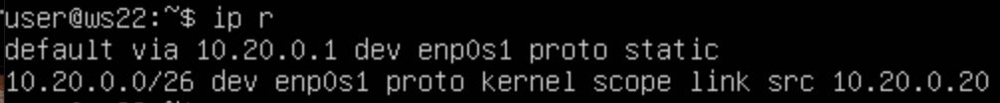
  - Ping ws11 -> r2
    - 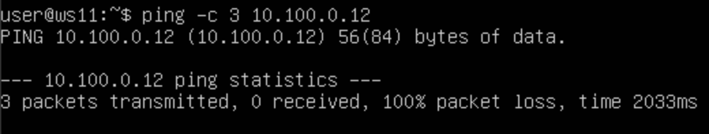
  - tcpdump на r2: `sudo tcpdump -tn -i enp0s1 icmp`
    - 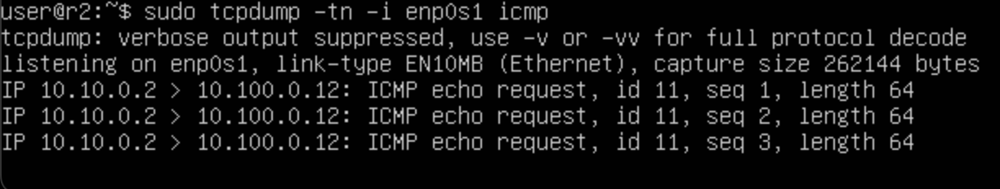
  - Результат: в tcpdump видны ICMP echo-запросы от ws11

## Part 6. Динамическая настройка IP с помощью DHCP

- **Статус:** не выполнено

## Part 7. NAT

- **Статус:** не выполнено

## Part 8. Дополнительно. Знакомство с SSH Tunnels

- **Статус:** не выполнено
